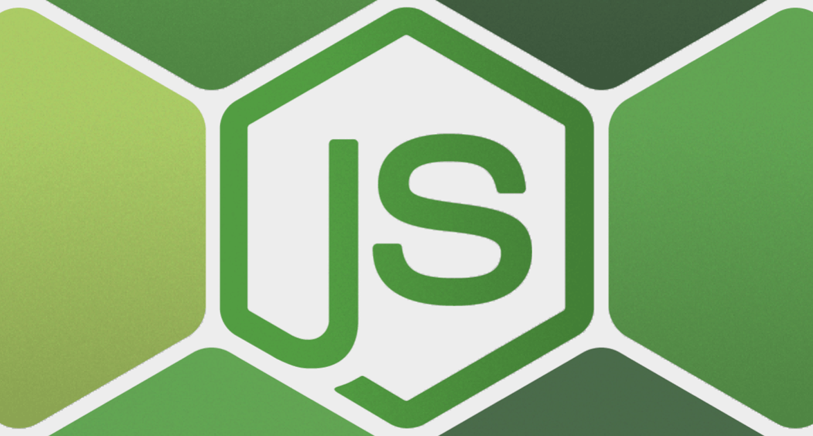

# Pre-Requisite for Node.js

Contains most important features and prerequisite concepts for better understanding of Node.js

## Table of Contents (TOC)

| **Sl. No**   | **Title/Topic** |  
|:----------:|-----| 
| 1  | [What is JavaScript?](module-1/README.md)  |
| 2  | [Synchronous Programming v/s Asynchronous Programming](module-2/README.md)  |
| 3  |  [Fundamentals of JavaScript]()  <ul><li>[Data-Types](module-3/DATA_TYPES.md)</li><li>[Declaring Variables](module-3/DECLARING_VARIABLE.md)</li><li>[Functions]()</li></ul> |
| 4  |   |
| 5  |   |
| 6  |   |
| 7  |   |
| 8  |   |
| 9  |   |