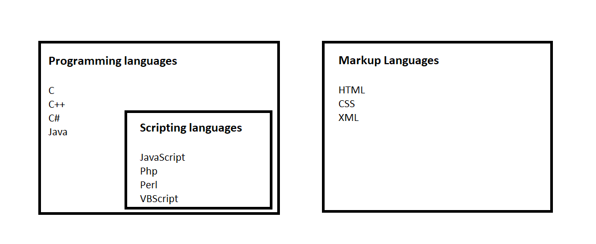

## What is JavaScript?

JavaScript was initially created to **"make webpages alive"**.

The programs in this language are called scripts. They can be written right in the HTML and execute automatically as the page 
loads.
Scripts are provided and executed as a plain text. They don't need a special preparation or a compilation to run.
In this aspect, JavaScript is very different from another language called Java.
 

> When JavaScript was created, it initially had another name: "LiveScript". But Java language was very popular at that time, 
> so it was decided that positioning a new language with a similar name of Java would help.
> As it evolved, JavaScript became a fully independent language, with its own specification called [ECMAScript](https://github.com/shravankb/ECMAScript-Specifications), 
> and it has no relation to Java at all.

 
 

JavaScript is a scripting language; 
- that allows you to implement complex features on web pages.
- 3rd Main layer of WEB TECHNOLOGY
- Programming language for the WEB
- Updates and changes both HTML and CSS

#### Scripting language & Programming language

- Scripting languages are rather interpreted and not compiled; Programming languages are compiled.
- All Scripting languages are Programming languages

**[ :back: Back to Top](https://github.com/shravankb/pre-requisite-nodejs)**