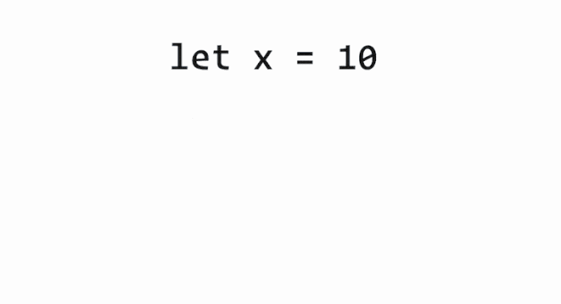

# Fundamentals of JavaScript

## Declaring Variables

#### Defining Variable

A variable is a "named storage" for data. We can use variables to store goodies, visitors and other data.
To create a variable in JavaScript, we need to use the let keyword.

The statement below creates (in other words: declares or defines) a variable with the name "message":

```javascript
var message;
```


Now we can put some data into it by using the assignment operator =:
```javascript
var message;

console.log(message); //undefined

message = 'Hello'; // store the string

console.log(message); // 'Hello'

let num = 10;

console.log(num); // 10

```

The **var** keyword is almost the same as **let**. It also declares a variable, but in a slightly different, "old-school" fashion. 
There are subtle differences between let and var, but they do not matter for us yet. We'll learn in detail later, in the 
coming articles.

Normally, we need to define a variable before using it. But in the old times, it was technically possible to create a 
variable by a mere assignment of the value, without **let**.

This still works now if we don't put **use strict**, the behavior is kept for compatibility with old scripts.

```javascript
// note: no "use strict" in this example

num = 5; // the variable "num" is created if didn't exist

console.log(num); // 5
```

That's a bad practice, it gives an error in the strict mode:

```javascript
"use strict";

num = 5; // error: num is not defined
```
**[ :back: Back to Table of Content](https://github.com/shravankb/pre-requisite-nodejs)** 

**[ :next: Declaring Variable](https://github.com/shravankb/pre-requisite-nodejs/blob/main/module-3/PROGRAMMING_CONSTRUCTS.md)**