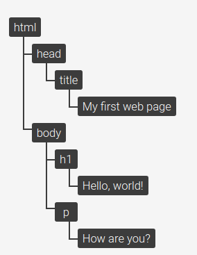

# Fundamentals of JavaScript

## DOM - Document Object Model


#### What is DOM?

JavaScript can access all the elements in a webpage making use of Document Object Model (DOM). In fact, the web browser 
creates a DOM of the webpage when the page is loaded. The DOM model is created as a tree of objects like this:

The Document Object Model, or the “DOM”, is an interface to web pages. It is essentially an API to the page, allowing 
programs to read and manipulate the page’s content, structure, and styles. 

**Let’s break this down.**

##### How is a web page built?

How a browser goes from a source HTML document to displaying a styled and interactive page in the viewport is called the “Critical Rendering Path”.

The Critical Rendering Path, these steps can be roughly grouped into two stages. The first stage involves the browser parsing the document to determine what will ultimately be rendered on the page, and the second stage involves the browser performing the render.


The result of the first stage is what is called a “render tree”. The render tree is a representation of the HTML elements that will be rendered on the page and their related styles. In order to build this tree, the browser needs two things:

- The CSSOM, a representation of the styles associated with elements
- The DOM, a representation of the elements

##### How is the DOM created (and what does it look like)?

The DOM is an object-based representation of the source HTML document. It has some differences, as we will see below, but it is essentially an attempt to convert the structure and content of the HTML document into an object model that can be used by various programs.

The object structure of the DOM is represented by what is called a “node tree”. It is so called because it can be thought of as a tree with a single parent stem that branches out into several child branches, each which may have leaves. In this case, the parent “stem” is the root <html> element, the child “branches” are the nested elements, and the “leaves” are the content within the elements.

Let’s take this HTML document as an example:

```html
<!doctype html>
<html lang="en">
 <head>
   <title>My first web page</title>
  </head>
 <body>
    <h1>Hello, world!</h1>
    <p>How are you?</p>
  </body>
</html>
```

This document can be represented as the following node tree:



##### What is DOM made up of?

Document Object Model for a webpage is made of four entities :

- **Window Object** : is at the top of hierarchy; outmost element.

- **Document Object** : Each HTML document that gets loaded into window is document object

- **Form Object** : Everything that closed under `<form>.......</form>`

- **Form Control Elements** : Those Objects/elements that falls under <form> Object


##### Why are we explaining DOM?

Initially JavaScript came into picture, as scripting language mainly to act as **interface** to the DOM in the web-page. Even now, Vanilla JS / Pure JS, without any framework/library, if we need to keep the webpage dynamic, JavaScript is the only way.


Event listeners Based On DOM; where DOM APIs provided by the DOM, are used by JavaScript to access/alter the elements of the webpage or respond to triggered event.

Example:

- When a user clicks the mouse

- When a web page has loaded

- When an image has been loaded

- When the mouse moves over an element

- When an input field is changed

- When an HTML form is submitted

- When a user strokes a key


Example code-snippet:

> Try this for fun and try to understand whats happening here

```html
<html>
<head>
	<title>DOM!!!</title>
</head>
<body>
  <input type="button" id="btnClick" value="Click Me!!" />
  <script type="text/javascript">
	document.getElementById("btnClick").addEventListener("click", clicked);
    function clicked()
    {
   		 alert("You clicked me!!!");
    }	
  </script>
</body>
</html>
```