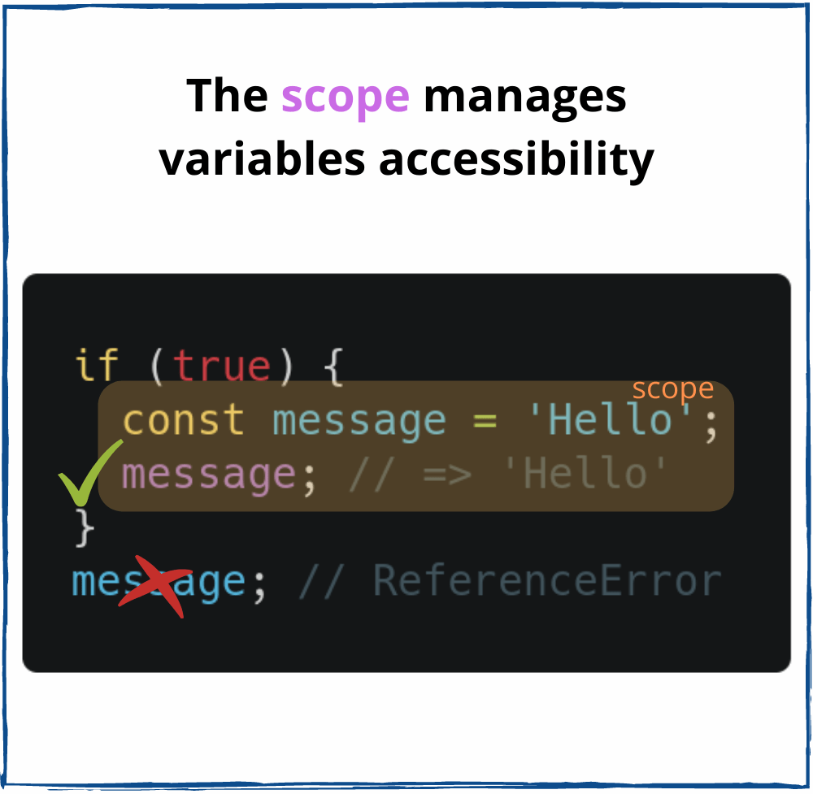
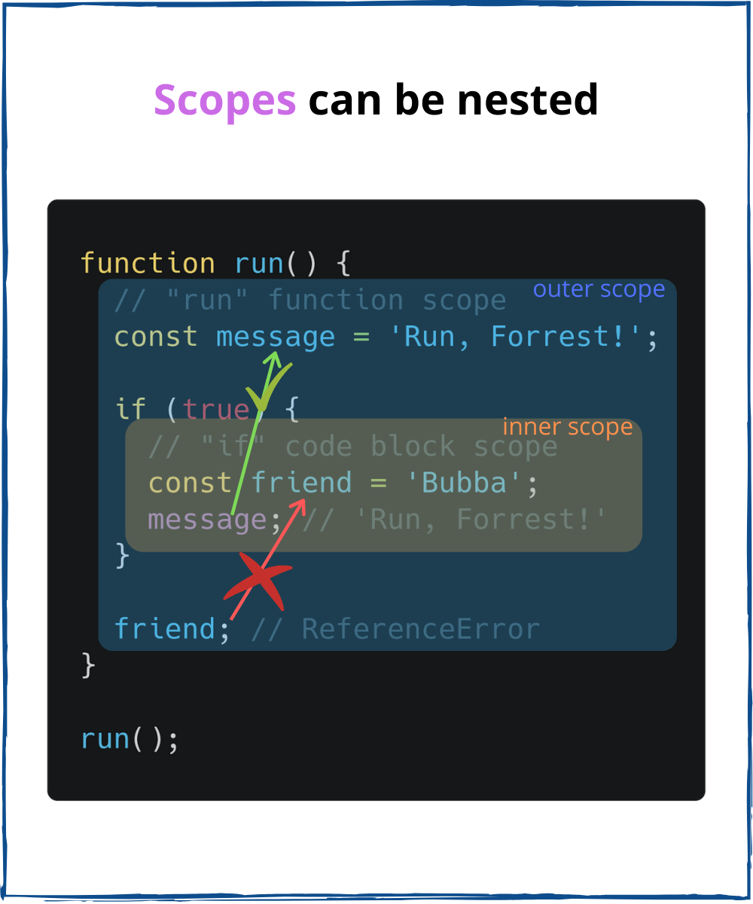

# Fundamentals of JavaScript

## Functions

Functions are the main "building blocks" of the program. They allow the code to be called many times without repetition.

You must've already seen examples of built-in functions, like alert("message"), console.log("message"). But we can create functions of our own as well.

### Function Declaration

To create a function we can use a function declaration, as shown below:

```javascript
  function showMessage() {
    console.log( 'Hello everyone!' );
  }
```

The `function` keyword goes first, then goes the *name of the function*, then a list of *parameters* in the brackets (empty in the example above) and finally the code of the function, also named "the function body".


Our new function can be called by its name: `showMessage()`. We can invoke the function or call the function using the function name followed by `()`, for instance:

```javascript

// function declaration
function showMessage() {
  console.log( 'Hello everyone!' ); // function definition
}


/**
* function call; showMessage() has been called/invoked two times
*/
showMessage(); // Hello everyone!
showMessage(); // Hello everyone!

```

Note: A function can return a value back into the calling code as the result.


The simplest example would be a function that sums two values:

```javascript
function sum(a, b) {
  return a + b;
}

let result = sum(1, 2);

console.log( result ); // 3

```

#### Variable scope in functions


A variable has global scope if it exists during the life of the program and is accessible from anywhere in the program. A variable 
has function scope if it is declared within a function and is not accessible outside of that function and will cease to exist when
the function finishes execution.


<p float="left">
  
   
</p>


With function scope, the parameters and variables that you define as part of a function are not available outside the function 
body; they are only visible within the function throughout the lifetime of the function.

```javascript

var num = 1;          // variable is global
function showGlobal() {
  console.log(num);         // uses the global num
}
showGlobal();         // 1

function showLocal(){
  var num = 2;        // num is local, hides the global num 
  console.log(num);
}
showLocal();           // 2

function showArgument(num) {
    console.log(num);       // arguments are locally scoped
}
showArgument(3);      // 3

```

What about the variable’s accessibility? Here’s one simple rule to remember:
> "The inner scope can access the variables of its outer scope."


## JavaScript Function Objects


