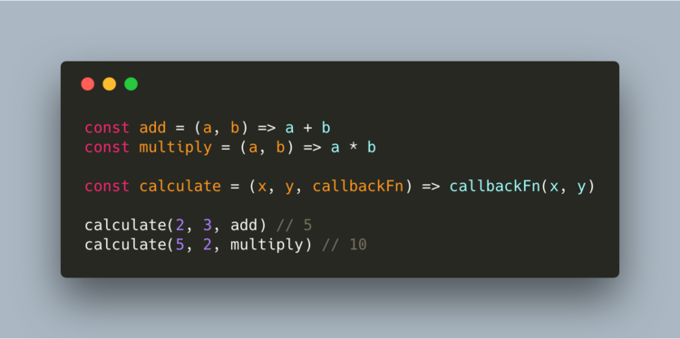
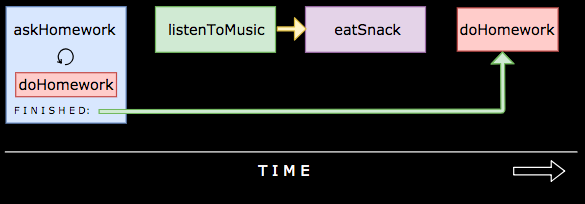
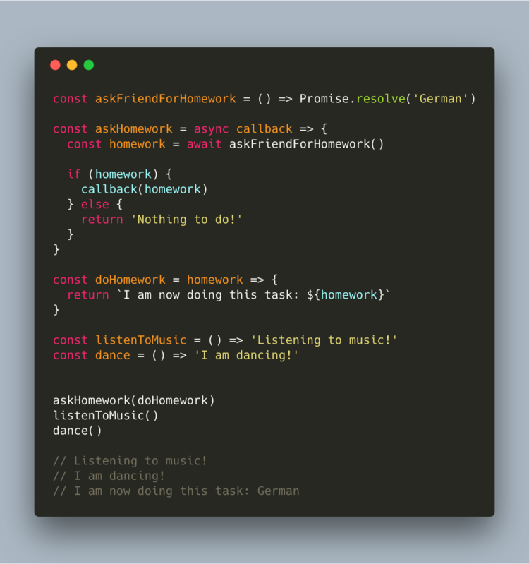

# Fundamentals of JavaScript

## Callbacks

Note: We will be using arrow functions through out this article. Basically we’ll be replacing anonymous functions like so:

```javascript
function() {}       function(a) {}        function(a,b) {}
```
can be written as:

```javascript
() => {}          a => {}            (a,b) => {}
```


Functions can receive arguments, but have you ever thought about the possibility that one of these arguments can be a function? 

> Yes, it can! Just like this:



- Functions that receive functions are called **higher-order functions**.
- Functions that get passed to other functions are called **callback functions**. 

We first define two functions: add, and multiply. Later on, we define a function called “calculate” which can receive 
three arguments: the first two are the values that we want to do some calculation with, and the third is the function 
that we can pass. 


### Asynchronous callbacks

Callbacks are a way to make sure certain code doesn’t execute until other code has already finished execution. The 
callback function is not run until the containing function invokes it, or “calls it back”. Once the containing function
has stopped running, it calls back to the function that was passed in the parameter, hence the name callback function. 

This example is a synchronous callback, the callback function is being run where we invoke it. 

However, often callback functions are being executed after an asynchronous function has completed, i.e., instead of 
immediately returning some result like most functions, functions that use callbacks take some time to produce a result. 

The word 'asynchronous', aka 'async' just means 'takes some time' or 'happens in the future, not right now'. Usually 
callbacks are only used when doing I/O, e.g. downloading things, reading files, talking to databases, etc.


For example, you need to do homework but you forgot what the assignment was. In order to figure it out, you send a 
message to a friend and ask what the homework is. This could take a while: maybe your friend is busy and responds 
in 10 minutes, we don’t know! However, we’re not just gonna sit there and do absolutely nothing until he responds, 
instead we can still do other things such as listening to music and eating food. 

Once your friend has responded, you know what the homework is, and you can actually do your homework. This would look 
something like: 



Or in code: 



Don’t worry if some of this syntax is still unfamiliar to you: we will cover promises, and async/await in further parts. 

Here, we invoke the higher-order askHomework function with the callback function doHomework. If there is homework to do, this function will be invoked. 

While you were was waiting for your friend to respond, you could still listen to music and eat snacks. You just made sure that the doHomework function didn’t get run before the askHomework function was completed: otherwise you wouldn’t know what homework to do!


#### What is "callback hell"?

Asynchronous JavaScript, or JavaScript that uses callbacks, is hard to get right intuitively. A lot of code ends up looking like this:

```javascript
fs.readdir(source, function (err, files) {
  if (err) {
    console.log('Error finding files: ' + err)
  } else {
    files.forEach(function (filename, fileIndex) {
      console.log(filename)
      gm(source + filename).size(function (err, values) {
        if (err) {
          console.log('Error identifying file size: ' + err)
        } else {
          console.log(filename + ' : ' + values)
          aspect = (values.width / values.height)
          widths.forEach(function (width, widthIndex) {
            height = Math.round(width / aspect)
            console.log('resizing ' + filename + 'to ' + height + 'x' + height)
            this.resize(width, height).write(dest + 'w' + width + '_' + filename, function(err) {
              if (err) console.log('Error writing file: ' + err)
            })
          }.bind(this))
        }
      })
    })
  }
})
```

See the pyramid shape and all the `})` at the end? Eek! This is affectionately known as callback hell.

The cause of callback hell is when people try to write JavaScript in a way where execution happens visually from top to bottom. 

Lots of people make this mistake! In other languages like C, Ruby or Python there is the expectation that whatever happens on line 1 will finish before the code on line 2 starts running and so on down the file. As you will learn, JavaScript is different.

Note: Callback hell is caused by poor coding practices.
