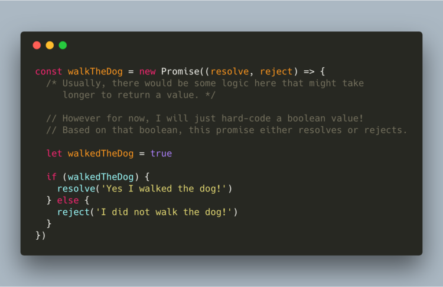
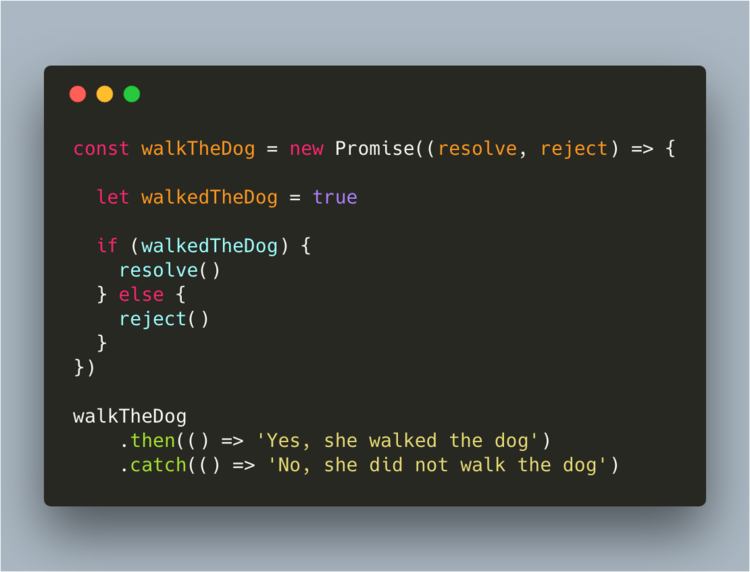
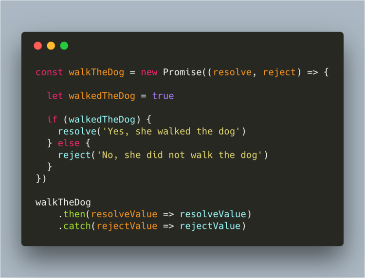
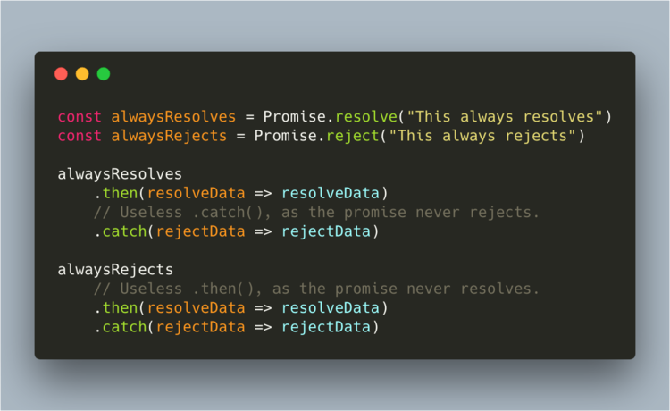
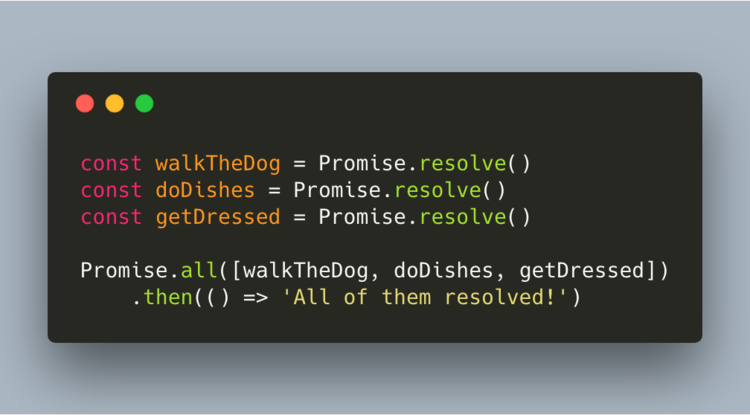

# Fundamentals of JavaScript

## Promises

Now, imagine that that callback function contained another callback function, then that callback function had another 
callback function. This would lead to very chaotic code; called **callback-hell**.

To avoid that, we use promises. With promises, we can postpone the execution of a code block until an another 
operation is completed. This way, other operations can keep running without interruption.

A simple way to show how a promise works is by explaining it with a real-life example. Let’s say that we promise 
someone we’ll walk the dog later. You can promise something, but that doesn’t necessarily mean you’ll do it! 

> ES6 introduced Promises 
>"A promise is a placeholder for a value that can either resolve or reject at some time in the future"

A promise can either resolve, or reject. A promise resolves if it actually did what we expected it to do, just 
like it “promised”. However, if anything went wrong for any reason, the promise rejects. 

A promise may complete at some point and produce a value. Once that value is ready, it allows you to do something 
with that value.

Promises have three states: 
- Pending: the initial state of the promise
- Fulfilled: the specified operation was completed.
- Rejected: the operation did not complete.

Now, we can do something based on whether the promise has resolved, or rejected. This can be done by using 
“.then()” or “.catch()". If a promise resolved, “.then()” will be fired, else “.catch()” will be fired. 

We can also pass values from the promise to the “.then()” or “.catch()”. We can do this by adding that value 
between the parentheses in either “resolve()” or “reject()”. That value then gets passed as an argument to 
“.then()” or “.catch()”, where we can use it.

This example, and the example above, actually return the same value. The parameters of the .then() and .catch() 
have the value of the strings passed to resolve and reject.

If you always want a promise to resolve, and not even think about the possibility of rejecting, you can simply 
type Promise.resolve(). If you always want a promise to reject, you can write Promise.reject().

If you want to wait for several promises to all resolve, you can use Promise.all. We pass all promises in an array, 
and only if all of them resolved,  “.then()” will get fired.

